# 🎵 GroovoX

> A modern music streaming platform built with React Native that empowers independent artists to share their music and connect with new listeners.

## 📖 Overview

GroovoX is a mobile music streaming application designed to help independent and upcoming artists reach a wider audience without requiring paid promotion or an existing fan base.

Artists can upload their music for free, while listeners can discover, stream, and save tracks from emerging creators.

---

## 🚀 Features

- 🎵 Stream music
- ⬆️ Upload songs with cover artwork
- ❤️ Save favourite tracks
- 🔍 Discover new music
- 👤 Artist profiles
- 🔐 Secure authentication
- 📱 Responsive mobile interface

---

## 📸 App Screenshots

### 🏠 Home

  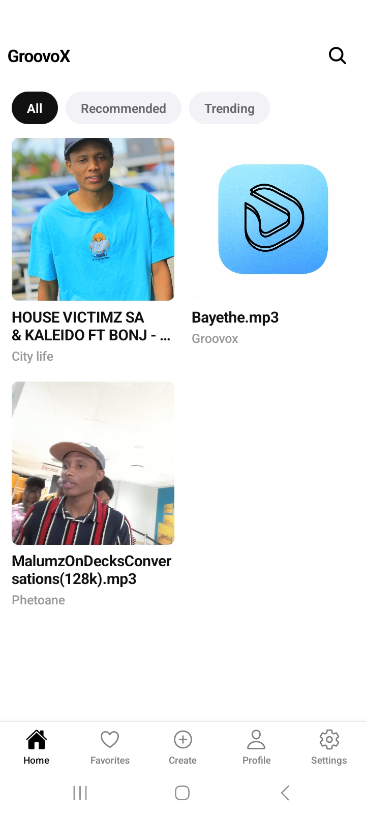
  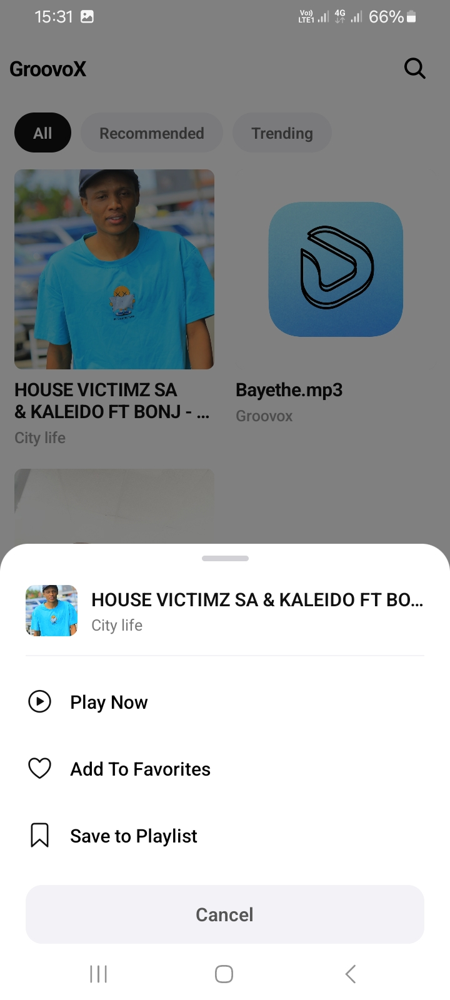
  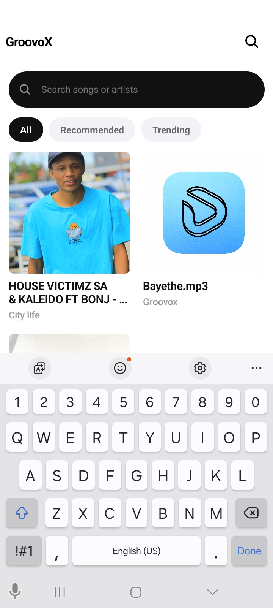
  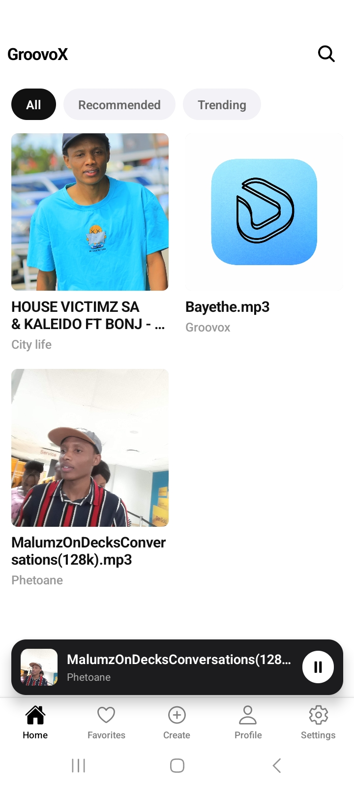

### ❤️ Favorites

  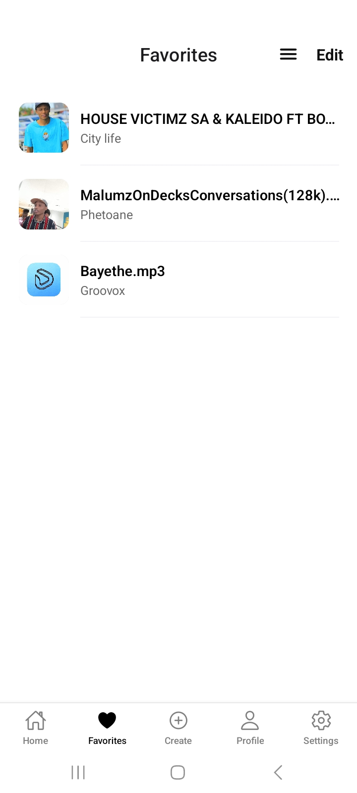
  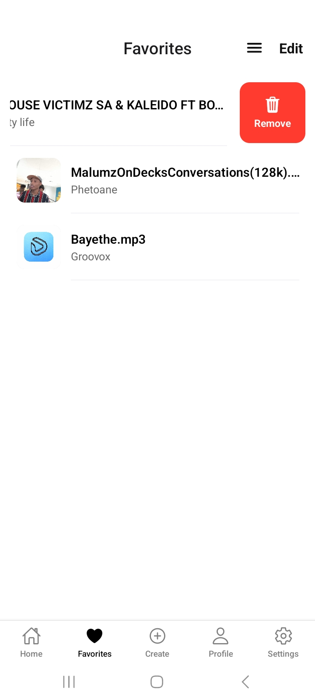
  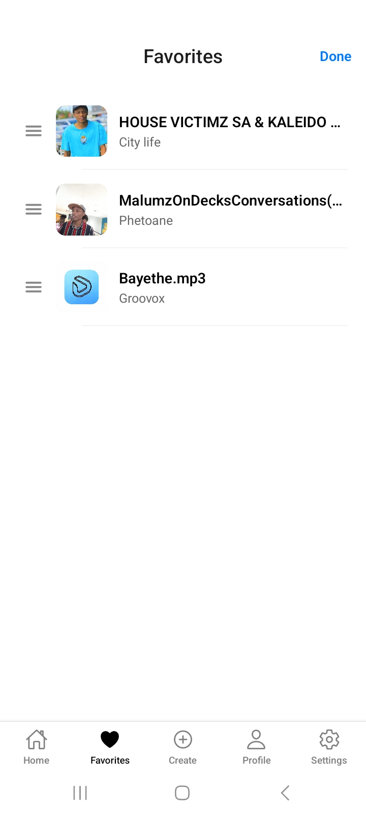
  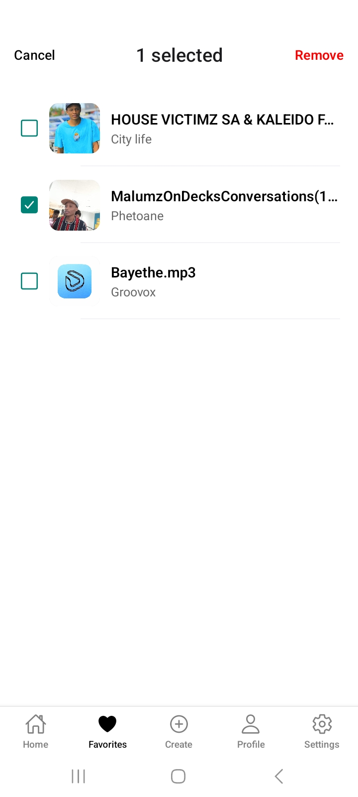

### ⬆️ Create

  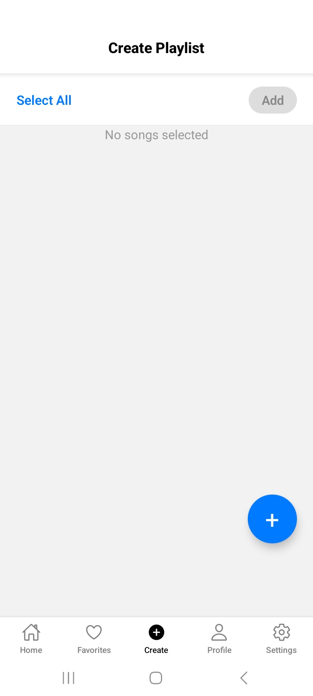
  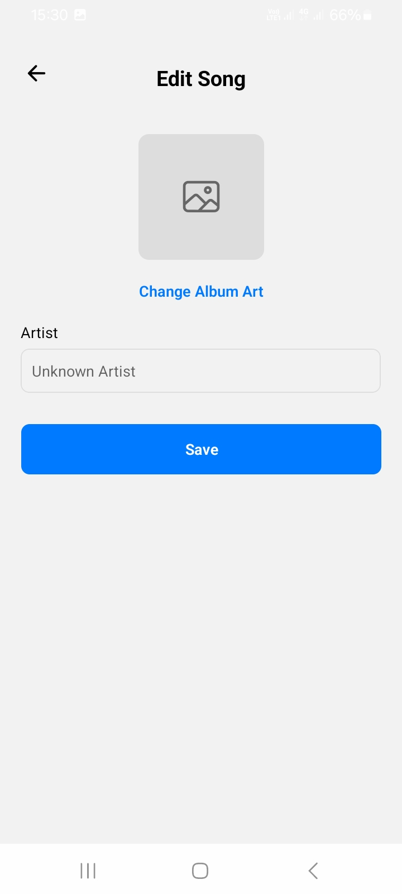
  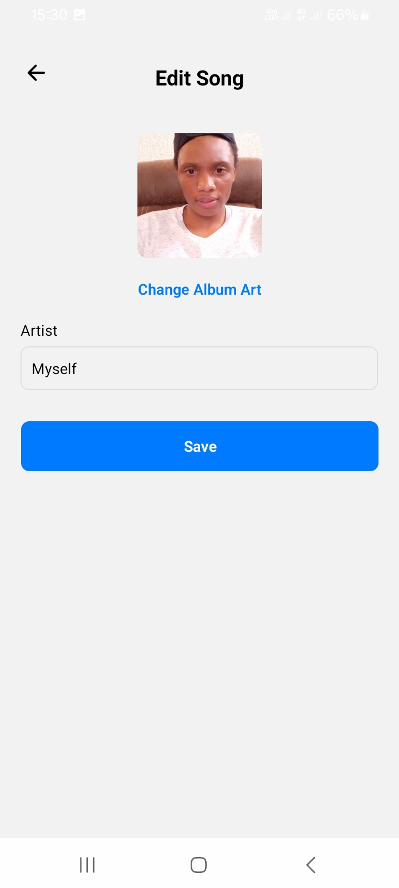
  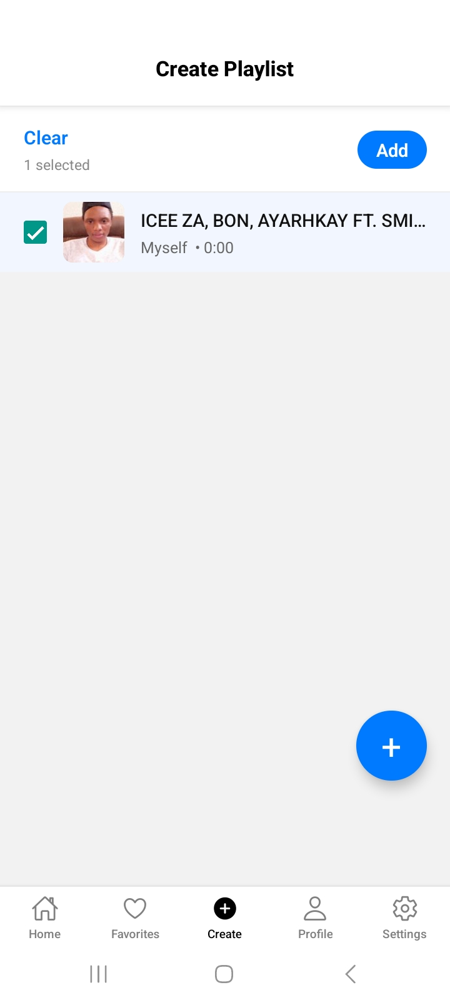

### 🎵 Music Player

  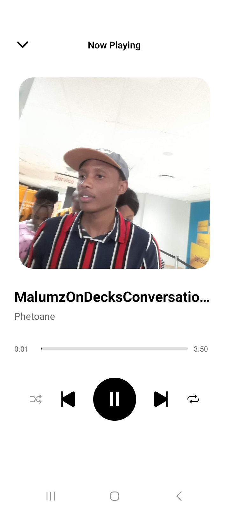

### 👤 Profile

  
  
  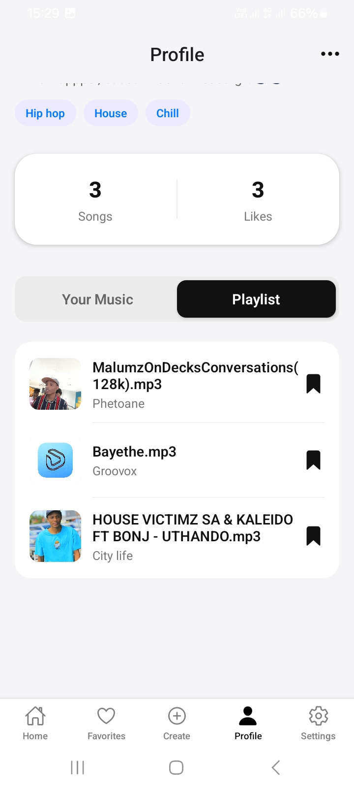
  

### ⚙️ Settings & Authentication

  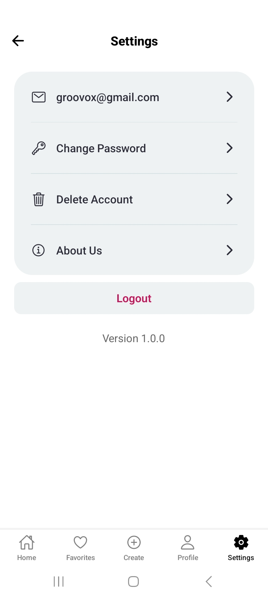
  
  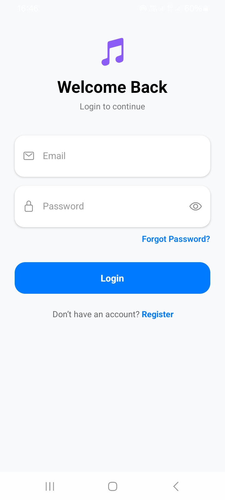
  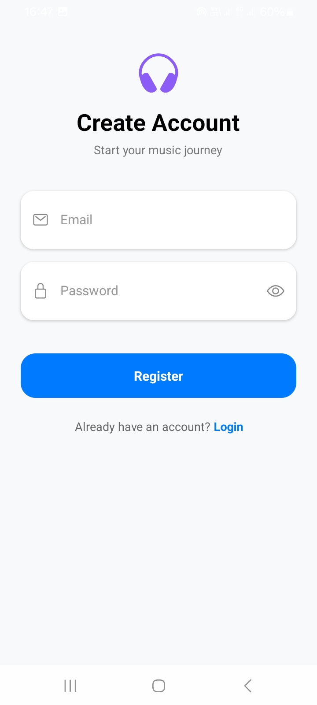
  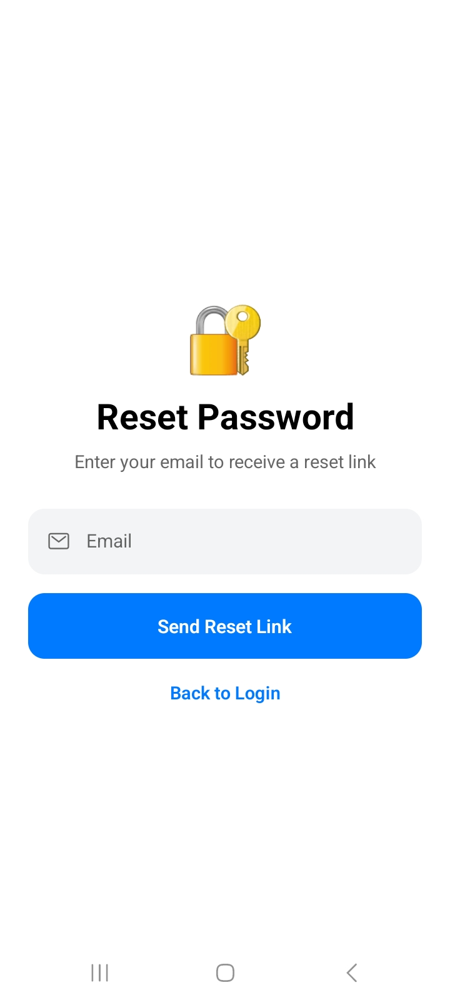

## 🛠 Tech Stack

- React Native
- Expo
- Expo Router
- JavaScript
- Node.js
- Supabase
- SQL
- Zustand
- EAS Build

---

## 📱 Screens

- Home
- Favorites
- Upload
- Artist Profile
- Settings
- Login
- Sign Up

---

## 💡 Problem

Many talented independent artists struggle to get their music heard because most streaming platforms prioritize already established musicians or require paid promotion.

---

## ✅ Solution

GroovoX provides a free platform where independent artists can upload their music and listeners can discover new talent through a simple and intuitive mobile experience.

---

## 🔒 Source Code

The source code for GroovoX is private because the application is currently under active development and planned for commercial release.

This repository serves as a showcase of the project, including documentation, screenshots, and demonstrations of the application's features.

---

## 🚀 Development & Deployment

- Expo SDK
- EAS Build
- Android Development Builds

---

## 👨‍💻 Developer

**Tieho Lucas Phetoane**

React Native Developer | JavaScript Developer

📧 tpldev7@gmail.com

🔗 GitHub: https://github.com/lucasphetoane

---

## ⭐ Support

If you like this project, consider giving the repository a star to support its development.
